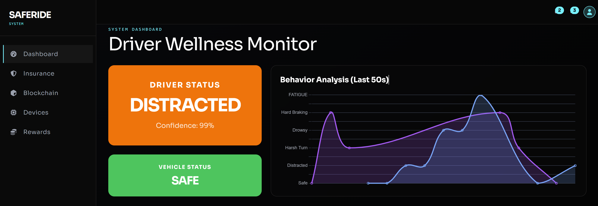

# SafeRide: DePIN Driver Safety Network 🛡️🚗

<!-- >> **Hackathon Winner Candidate 🏆 | Solana DePIN Track** -->

**SafeRide** is a Decentralized Physical Infrastructure Network (DePIN) that incentivizes safe driving using AI, IoT, and the Solana Blockchain. It detects driver fatigue and distraction in real-time, logging critical safety data immutably on-chain.

 

---

## 🌟 Key Features

*   **👁️ AI-Powered Monitoring:** Real-time Computer Vision (MediaPipe) detects **Drowsiness** (Eye Aspect Ratio) and **Distraction** (Head Pose).
*   **🏎️ IoT Telemetry:** Raspberry Pi Pico W captures vehicle dynamics like **Rash Driving** and **Impact Detection**.
*   **⛓️ Immutable Ledger:** Safety incidents are cryptographically signed and logged on **Solana Devnet** using the Memo Program.
*   **📊 Live Dashboard:** A modern SvelteKit UI displaying real-time driver status, health metrics, and blockchain verification.
*   **💰 Token Rewards:** Drivers earn points for "Safe Streaks," redeemable for insurance discounts (Mock).

---

## 🏗️ System Architecture

The system follows a robust "Edge-to-Chain" architecture:

1.  **Edge (IoT/AI):** 
    *   **Computer Vision Agent:** Python + MediaPipe (runs on host/laptop).
    *   **Vehicle Unit:** Raspberry Pi Pico W (MicroPython) sends MQTT telemetry.
2.  **Ingestion:**
    *   **MQTT Broker:** Eclipse Mosquitto (Docker).
    *   **Backend:** Go (Gin) Service.
3.  **State & Storage:**
    *   **Hot State:** Redis (Docker).
    *   **Cold Storage:** Solana Blockchain (Devnet).
4.  **Presentation:**
    *   **Frontend:** SvelteKit + TailwindCSS (Docker).

---

## 🚀 One-Click Demo Setup

We have containerized the entire stack for a seamless "One-Click" launch.

### Prerequisites
*   **Docker Desktop** (Running)
*   **Python 3.10+** (For the Computer Vision Agent)
*   **Webcam**

### Step 1: Launch the Cloud Stack ☁️
Run the following command to start the Backend, Frontend, Redis, and MQTT broker:

```bash
docker-compose up --build
```

Once the build completes:
*   **Dashboard:** [http://localhost:3000](http://localhost:3000)
*   **API:** [http://localhost:8080](http://localhost:8080)

### Step 2: Launch the AI Agent 🦅
The Computer Vision agent runs directly on your machine to access the webcam.

**First Time Setup:**
If you encounter any issues with the auto-setup, or if you are on a new machine, run the setup script first to install `uv` and dependencies.

*   **Windows:** `setup_cv.bat`
*   **Mac/Linux:** `./setup_cv.sh` (Make sure to run from the project root)

**Run the Agent:**
*   **Windows:** `run_cv.bat`
*   **Mac/Linux:** `./run_cv.sh`

> **⚠️ MacOS Users:** You must grant **Camera Permissions** to your Terminal/IDE (VS Code, iTerm, etc.) in `System Settings > Privacy & Security > Camera` for the agent to work.

*Ensure your webcam is active. The agent will start publishing "Fatigue" or "Safe" signals to the dashboard based on your face.*

---

## 🧪 Simulation / Manual Testing

If you don't have a webcam or want to force specific states, use our simulation scripts found in `scripts/windows` (for .bat) or `scripts/linux` (for .sh):

| Status Category | Script Name | Description |
| :--- | :--- | :--- |
| **Driver (AI)** | `send_safe_driver` | Resets Driver Status to Green. |
| | `send_fatigue` | Triggers Red Alert (Fatigue) & Solana Transaction. |
| | `send_distracted` | Triggers Distracted Alert. |
| | `send_drowsy` | Triggers Drowsy Alert. |
| **Vehicle (IoT)** | `send_safe_vehicle` | Resets Vehicle Status to Green. |
| | `send_harsh_turn` | Simulates dangerous turning. |
| | `send_hard_braking` | Simulates emergency braking. |

---

## 📂 Project Structure

*   `backend/`: Go (Gin) API & Solana Service.
*   `frontend/`: SvelteKit Dashboard (Svelte 5).
*   `cv/`: Python Computer Vision Logic.
*   `iot/`: MicroPython code for Pico W.
*   `docs/`: Detailed documentation & Dev Logs.

---

## 📜 Documentation & Resources

*   [**Development Blog**](docs/dev-blog.md): Read about our 4-day sprint journey.
*   [**Walkthrough Guide**](docs/walkthrough.md): Detailed feature explanation.
*   [**Insurance Model**](docs/insurance-ai-logic.md): The math behind the safety score.

---
